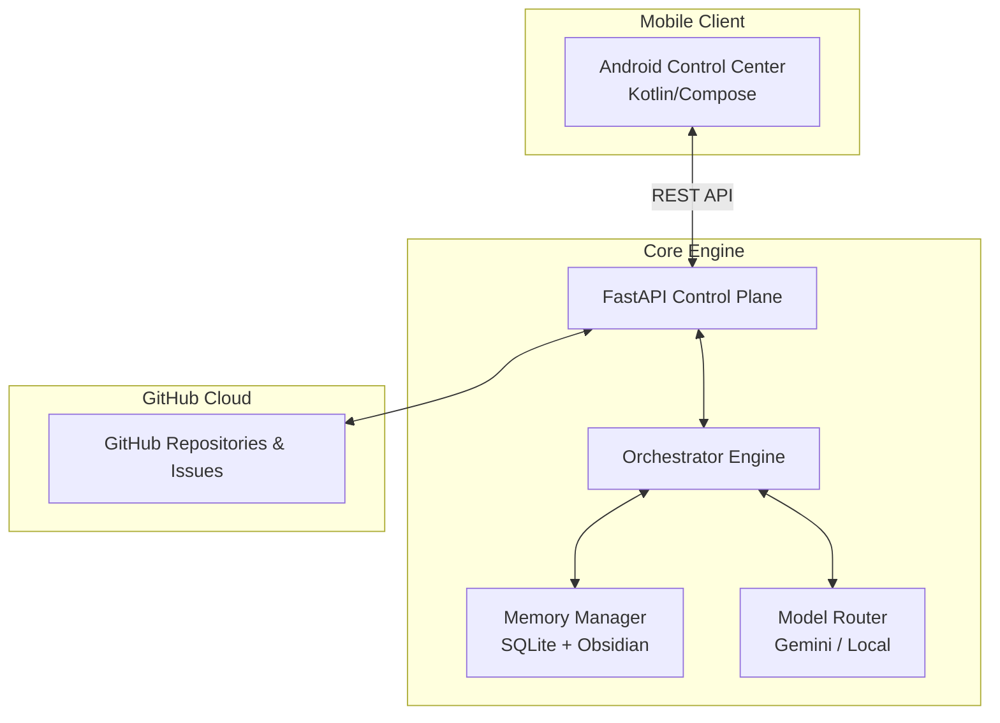

<div align="center">


**EvoForge** is an autonomous, self-improving, multi-agent software engineering organization living in your terminal—and now, in your pocket. It doesn't just write code; it manages projects, learns from failures, researches new techniques, and evolves its own capabilities.

[](https://github.com/Benadic90)
[](https://python.org)
[]()
[]()

---

[Features](#-key-features) •
[Architecture](#-system-architecture) •
[Mobile App](#-android-control-center) •
[Getting Started](#-getting-started) •
[Security](#-security--policy)

</div>

<br>

## ✨ Key Features

*   🧠 **State-Machine Orchestrator**: Topologically prioritizes workflows and manages execution states via SQLite.
*   🔄 **Continuous Learning Loop**: Agents research, experiment in sandboxes, benchmark their skills, and auto-deploy self-improvements.
*   📱 **Android Control Center**: A dedicated Material 3 mobile app to manage projects, AI compute nodes, and API keys securely over your LAN.
*   🛡️ **Policy Engine**: Strict shell allowlisting, secret detection, and RBAC to prevent runaway agents or credential leaks.
*   💾 **Dual-Memory Layer**: Combines SQLite for strict state tracking with an Obsidian Markdown Vault for semantic long-term knowledge.
*   🔀 **Model Routing**: Dynamically routes tasks to Gemini, Ollama, or NVIDIA models based on complexity, with automatic fallback logic to prevent API outages.

<br>

## 📱 Android Control Center

EvoForge includes a fully native Android companion app built in Kotlin and Compose (Material 3). It acts as your mission control for the AI agents running on your PC.

- **Dynamic Compute Routing**: Toggle between **LOCAL** (Ollama), **CLOUD** (Gemini/NVIDIA), or **HYBRID** compute models directly from your phone.
- **GitHub Integration**: Securely send your GitHub Personal Access Token from your phone to the backend to authenticate project scanning.
- **Project Portfolio**: View real-time health scores, priorities, and workflow statuses for all your GitHub repositories managed by EvoForge.
- **Agent Telemetry**: (Coming Soon) Watch agents execute tasks in real-time.

<br>

## 🏗 System Architecture

EvoForge is a distributed system consisting of a monolithic Python orchestration engine and a mobile frontend.



<br>

## 🚀 Getting Started

Follow these steps to spin up the entire EvoForge ecosystem like a professional.

### 1. Backend Setup

1. **Clone the repository**:
   ```bash
   git clone https://github.com/Benadic90/EvoForge.git
   cd EvoForge
   ```

2. **Configure Environment Variables**:
   Copy the example template and add your LLM API keys:
   ```bash
   cp .env.example .env
   ```
   *Edit `.env` and insert your `GEMINI_API_KEY` and `NVIDIA_API_KEY`.*

3. **Install Dependencies & Run**:
   EvoForge uses `uv` for lightning-fast Python dependency management.
   ```bash
   uv run python -m evoforge.main serve
   ```
   *The control plane is now running on `0.0.0.0:8000`.*

### 2. Mobile App Setup

1. Open the `android/EvoForgeAndroid` folder in **Android Studio**.
2. Build and flash the APK to your Android device (Android 14+ recommended).
3. Ensure your phone and PC are on the same Wi-Fi network.
4. In the app, go to the **Settings** tab.
5. Set the **Control Plane URL** to your PC's local IP (e.g., `http://192.168.1.5:8000`).
6. Enter a valid GitHub Personal Access Token (PAT) and tap **Verify & Save**.

### 3. Add a Project

To tell EvoForge to start managing a GitHub repository, open a terminal on your PC and run:
```bash
uv run python -m evoforge.main project add YourUsername/YourRepo
```
*Your project will instantly appear in the Android app with its health score and priority!*

<br>

## 🤖 The Agent Roster

EvoForge behaves like a real software engineering department. Each agent has a specific role, system prompt, and set of tools.

| Agent | Role | Capabilities |
| :--- | :--- | :--- |
| 🧑‍💻 **Developer** | Core Engineering | Writes code, refactors, debugs, and implements features. |
| 🧪 **QA** | Testing & Validation | Generates test suites, runs `pytest`, and identifies regressions. |
| 🕵️ **Reviewer** | Code Review | Analyzes logic diffs, checks style, and enforces best practices. |
| 🔒 **Security** | Vulnerability Analysis | Scans for CVEs, OWASP violations, and audits pull requests. |
| 🏛️ **Architect** | System Design | Plans massive features and designs distributed architectures. |
| 🧬 **Evolution** | Meta-Analysis | Analyzes system failure logs to propose structural improvements to EvoForge itself. |

<br>

## 🛡️ Security & Policy

Autonomous agents are dangerous if left unchecked. EvoForge implements a strict `ActionValidator`:

*   **Shell Allowlist**: Agents cannot run arbitrary terminal commands. Commands like `rm -rf` are blocked at the regex level.
*   **Secret Detection**: Any output attempting to write or commit AWS keys, GitHub tokens, or RSA keys is intercepted and redacted.
*   **Budget Tracking**: Enforces a hard daily API budget to prevent infinite-loop bankruptcies.
*   **Zero-Trust Networking**: Only the explicitly configured GitHub tokens and LLM endpoints are allowed outbound access.

---

<div align="center">
<b>Built with 🧠 by <a href="https://github.com/Benadic90">Benadic90</a></b><br>
<i>"EvoForge should not merely execute software engineering tasks. It should continuously improve how it performs software engineering."</i>
</div>
