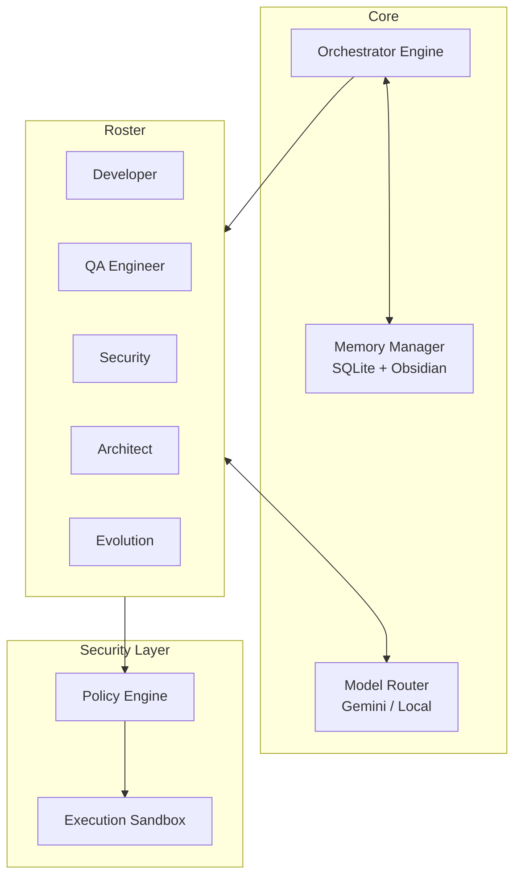

**EvoForge** is an autonomous, self-improving, multi-agent software engineering organization living in your terminal. It doesn't just write code—it manages projects, learns from failures, researches new techniques, and evolves its own capabilities.

---

[Key Features](#-key-features) •
[Architecture](#-system-architecture) •
[Agent Roster](#-the-agent-roster) •
[Continuous Learning](#-continuous-learning--evolution) •
[Security](#-security--policy)

## ✨ Key Features

*   🧠 **State-Machine Orchestrator**: Topologically prioritizes workflows and manages execution states via SQLite.
*   🔄 **Continuous Learning Loop**: Agents research, experiment in sandboxes, benchmark their skills, and auto-deploy self-improvements.
*   🛡️ **Policy Engine**: Strict shell allowlisting, secret detection, and RBAC to prevent runaway agents or credential leaks.
*   💾 **Dual-Memory Layer**: Combines SQLite for strict state tracking with an Obsidian Markdown Vault for semantic long-term knowledge.
*   🔀 **Model Routing**: Dynamically routes tasks to Gemini, Ollama, or NVIDIA models based on complexity, with automatic fallback logic to prevent API outages.

## 🏗 System Architecture

EvoForge is built as a monolithic Python application that coordinates a roster of highly specialized LLM-backed agents.

## 🤖 The Agent Roster

EvoForge behaves like a real software engineering department. Each agent has a specific role, system prompt, and set of tools.

| Agent | Role | Capabilities |
| :--- | :--- | :--- |
| 🧑‍💻 **Developer** | Core Engineering | Writes code, refactors, debugs, and implements features. |
| 🧪 **QA** | Testing & Validation | Generates test suites, runs `pytest`, and identifies regressions. |
| 🕵️ **Reviewer** | Code Review | Analyzes logic diffs, checks style, and enforces best practices. |
| 🔒 **Security** | Vulnerability Analysis | Scans for CVEs, OWASP violations, and audits pull requests. |
| 🏛️ **Architect** | System Design | Plans massive features and designs distributed architectures. |
| 🚀 **DevOps** | CI/CD & Infra | Configures pipelines, Docker, and deployment scripts. |
| 📖 **Docs** | Documentation | Writes READMEs, docstrings, and maintains the Obsidian Vault. |
| ⚖️ **Conflict Resolver**| Mediation | Acts as an objective LLM referee when agents disagree (e.g. Speed vs Security). |
| 🧬 **Evolution** | Meta-Analysis | Analyzes system failure logs to propose structural improvements to EvoForge itself. |

## 📈 Continuous Learning & Evolution

EvoForge doesn't remain static. It continuously improves its own capabilities over time through a structured learning loop.

1.  **Research**: Agents periodically search for new techniques (e.g., new framework releases or security CVEs).
2.  **Verification**: Sources are graded for reliability (Official Docs > Reddit).
3.  **Sandbox Experiments**: Agents practice new techniques in an isolated local sandbox.
4.  **Benchmarking**: The `BenchmarkRunner` scores the experiment.
5.  **Adoption**: If an agent achieves a >5% improvement on the benchmark, the `SkillUpdater` auto-deploys the new skill to the production agent's profile.

## 🛡️ Security & Policy

Autonomous agents are dangerous if left unchecked. EvoForge implements a strict `ActionValidator`:

*   **Shell Allowlist**: Agents cannot run arbitrary terminal commands. Commands like `rm -rf` are blocked at the regex level.
*   **Secret Detection**: Any output attempting to write or commit AWS keys, GitHub tokens, or RSA keys is intercepted and redacted.
*   **Budget Tracking**: The `CostTracker` enforces a hard daily API budget (default: $5.00/day) to prevent infinite-loop bankruptcies.
*   **Read/Write Constraints**: Agents can be restricted to specific directories or branches.

---

<b>Built with 🧠 by <a href="https://github.com/Benadic90">Benadic90</a></b> 
<i>"EvoForge should not merely execute software engineering tasks. It should continuously improve how it performs software engineering."</i>

