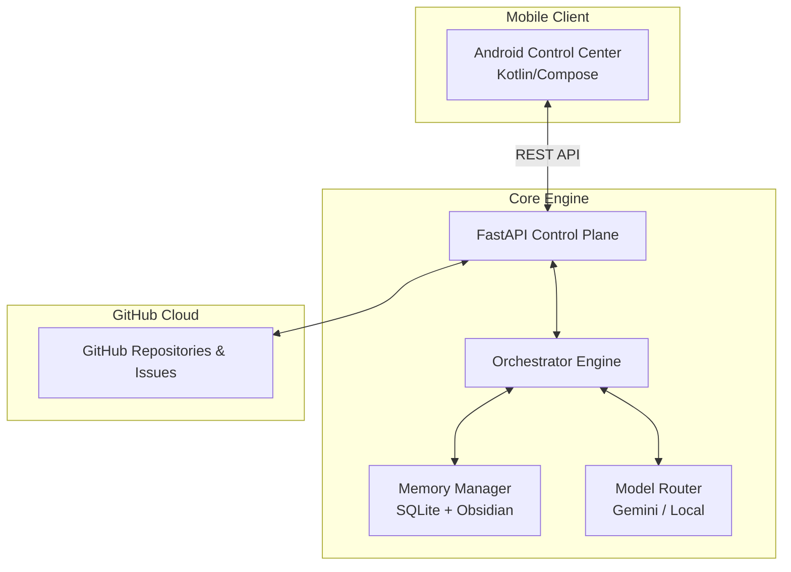

**EvoForge** is an autonomous, self-improving, multi-agent software engineering organization living in your terminal—and now, in your pocket. It doesn't just write code; it manages projects, learns from failures, researches new techniques, and evolves its own capabilities.

---

[Features](#-key-features) •
[Architecture](#-system-architecture) •
[Mobile App](#-android-control-center) •
[Getting Started](#-getting-started) •
[Security](#-security--policy)

 

## ✨ Key Features

*   🧠 **State-Machine Orchestrator**: Topologically prioritizes workflows and manages execution states via SQLite.
*   🔄 **Continuous Learning Loop**: Agents research, experiment in sandboxes, benchmark their skills, and auto-deploy self-improvements.
*   📱 **Android Control Center**: A dedicated Material 3 mobile app to manage projects, AI compute nodes, and API keys securely over your LAN.
*   🛡️ **Policy Engine**: Strict shell allowlisting, secret detection, and RBAC to prevent runaway agents or credential leaks.
*   💾 **Dual-Memory Layer**: Combines SQLite for strict state tracking with an Obsidian Markdown Vault for semantic long-term knowledge.
*   🔀 **Model Routing**: Dynamically routes tasks to Gemini, Ollama, or NVIDIA models based on complexity, with automatic fallback logic to prevent API outages.

 

## 📱 Android Control Center

EvoForge includes a fully native Android companion app built in Kotlin and Compose (Material 3). It acts as your mission control for the AI agents running on your PC.

- **Dynamic Compute Routing**: Toggle between **LOCAL** (Ollama), **CLOUD** (Gemini/NVIDIA), or **HYBRID** compute models directly from your phone.
- **GitHub Integration**: Securely send your GitHub Personal Access Token from your phone to the backend to authenticate project scanning.
- **Project Portfolio**: View real-time health scores, priorities, and workflow statuses for all your GitHub repositories managed by EvoForge.
- **Agent Telemetry**: (Coming Soon) Watch agents execute tasks in real-time.

 

## 🏗 System Architecture

EvoForge is a distributed system consisting of a monolithic Python orchestration engine and a mobile frontend.

 

## 🚀 Getting Started

Follow these steps to spin up the entire EvoForge ecosystem using the Free Tier of Render and your Android phone.

### 1. Cloud Backend Setup (Render)

EvoForge is designed to run 24/7 in the cloud so it can maintain your GitHub streak while you sleep.

1. Fork this repository to your own GitHub account.
2. Go to [Render.com](https://render.com) and create a new **Web Service**.
3. Connect your GitHub account and select your EvoForge fork.
4. Set the **Build Command** to: `curl -LsSf https://astral.sh/uv/install.sh | sh && /opt/render/.cargo/bin/uv sync`
5. Set the **Start Command** to: `/opt/render/.cargo/bin/uv run python -m evoforge.main server`
   - The server command reads Render's `$PORT` automatically and binds to `0.0.0.0`.
6. **Environment Variables**: You must add the following environment variables in your Render dashboard:
   - `GITHUB_TOKEN`: Your Personal Access Token (classic) with `repo` permissions.
   - `GEMINI_API_KEY`: Your Gemini AI API Key.
   - `WORKER_SECRET_TOKEN`: Generate a long random value and store the same value in the Android app's **Bearer Token** field. Never use `default-dev-token` in production.
7. Click **Deploy**. Wait until Render gives you a URL (e.g., `https://evoforge.onrender.com`).

### 2. Mobile App Setup (Android)

The Android app is your "Mission Control" to command the AI agent.

1. Open the `android/EvoForgeAndroid` folder in **Android Studio**.
2. Build and install the APK onto your Android phone.
3. Open the app and go to the **Settings** tab.
4. Set the **Control Plane URL** to your exact Render URL (e.g., `https://evoforge.onrender.com`).
5. Set your **Bearer Token** to the same value as Render's `WORKER_SECRET_TOKEN`.
6. Set your **GitHub PAT** and tap **Verify & Save**.

### 3. Adding Projects & Triggering the AI

1. Go to the **Projects** tab in the Android App.
2. Tap the blue **`+`** button in the bottom right corner.
3. Type the repository you want the AI to manage (e.g., `YourUsername/YourRepo`) and tap **Add**.
4. The AI is programmed to run once every 24 hours. **To force it to run immediately:** call `https://YOUR_RENDER_URL.onrender.com/api/force-run-daily` with `Authorization: Bearer <WORKER_SECRET_TOKEN>`.
5. Watch the **Dashboard** tab on your phone to see the AI's telemetry light up as it writes code!

 

## 🤖 The Agent Roster

EvoForge behaves like a real software engineering department. Each agent has a specific role, system prompt, and set of tools.

| Agent | Role | Capabilities |
| :--- | :--- | :--- |
| 🧑‍💻 **Developer** | Core Engineering | Writes code, refactors, debugs, and implements features. |
| 🧪 **QA** | Testing & Validation | Generates test suites, runs `pytest`, and identifies regressions. |
| 🕵️ **Reviewer** | Code Review | Analyzes logic diffs, checks style, and enforces best practices. |
| 🔒 **Security** | Vulnerability Analysis | Scans for CVEs, OWASP violations, and audits pull requests. |
| 🏛️ **Architect** | System Design | Plans massive features and designs distributed architectures. |
| 🧬 **Evolution** | Meta-Analysis | Analyzes system failure logs to propose structural improvements to EvoForge itself. |

 

## 🛡️ Security & Policy

Autonomous agents are dangerous if left unchecked. EvoForge implements a strict `ActionValidator`:

*   **Shell Allowlist**: Agents cannot run arbitrary terminal commands. Commands like `rm -rf` are blocked at the regex level.
*   **Secret Detection**: Any output attempting to write or commit AWS keys, GitHub tokens, or RSA keys is intercepted and redacted.
*   **Budget Tracking**: Enforces a hard daily API budget to prevent infinite-loop bankruptcies.
*   **Zero-Trust Networking**: Only the explicitly configured GitHub tokens and LLM endpoints are allowed outbound access.

---

<b>Built with 🧠 by <a href="https://github.com/Benadic90">Benadic90</a></b> 
<i>"EvoForge should not merely execute software engineering tasks. It should continuously improve how it performs software engineering."</i>

